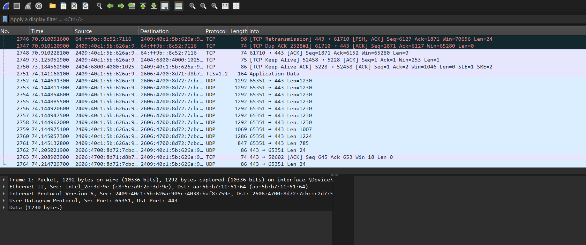

<div align="center">

# 🛡️ Operation Fire
### Blue Team Endpoint Monitoring & Investigation Lab
### *Detect. Investigate. Defend.* 🔐

[]()
[]()
[]()
[]()
[]()

</div>

---

## 🔥 What is Operation Fire?

> *A hands-on Blue Team security lab simulating real-world endpoint monitoring, threat detection and incident investigation.*

Operation Fire is a **beginner Blue Team cybersecurity lab** built to simulate how SOC analysts detect, monitor and investigate threats on real endpoints. Every screenshot in this repo is from a **live lab environment** — not theory, not tutorials — actual hands-on security work. 🛡️

---

## 🏗️ Lab Architecture

<div align="center">

</div>

```
Kali Linux VM (Attacker)
        ↓
Windows Endpoint (Target)
        ↓
Sysmon Monitoring (Event Collection)
        ↓
Windows Event Viewer (Log Analysis)
        ↓  
Wireshark (Network Traffic Analysis)
        ↓
Incident Documentation (SOC Report)
```

---

## 🔬 Lab Evidence & Screenshots

### 🟣 PowerShell Encoded Command Detection


> Detected a **base64 encoded PowerShell command** (`powershell -enc`) — a common attacker technique to obfuscate malicious scripts. Identified and documented as suspicious activity. ⚠️

---

### 📋 Sysmon Operational Logs — 604 Events Captured


> Sysmon captured **604 operational events** including Process Create (Event ID 1) and Process Terminate (Event ID 5) events. Monitored in real time to detect anomalous process behaviour. 🔍

---

### 🌐 Wireshark Packet Capture — Live Network Analysis


> Captured and analysed live network traffic including **TCP retransmissions, TLSv1.2 application data, and UDP streams** to port 443. Identified packet anomalies and documented findings. 📡

---

### 👤 Account Creation Event — Simulated Attack


> Simulated a **privilege escalation attack** by creating a rogue user account (`net user hacker_test /add`). Verified the event was captured and logged for investigation. 🚨

---

## 🛠️ Tools & Technologies

| Tool | Purpose |
|---|---|
| 🐉 **Kali Linux VM** | Attack simulation environment |
| 🪟 **Windows Endpoint** | Target machine for monitoring |
| 👁️ **Sysmon** | Deep endpoint event logging |
| 📋 **Windows Event Viewer** | Log analysis and investigation |
| 🦈 **Wireshark** | Network packet capture & analysis |
| 💻 **PowerShell** | Threat simulation & detection scripting |

---

## 🎯 What I Investigated

- 🔴 **Encoded PowerShell commands** — obfuscated script execution detection
- 🔴 **Rogue account creation** — privilege escalation simulation
- 🟠 **Sysmon process events** — 604 events captured and analysed
- 🟠 **Network traffic anomalies** — TCP/UDP packet analysis via Wireshark
- 🟡 **TLSv1.2 encrypted traffic** — application data flow monitoring

---

## 📂 Project Structure

```
operation-fire-blue-team-lab/
│
├── screenshots/
│   ├── operation_fire_architecture_png.png
│   ├── powershell_encoded_command_png.png
│   ├── sysmon_operational_logs_png.png
│   ├── wireshark_packet_capture.png
│   └── account_creation_event_png.png
│
├── docs/
│   └── incident-report.md        # SOC investigation findings
│
└── README.md
```

---

## 💡 What I Learned

- Setting up a **Blue Team lab environment** from scratch
- Configuring **Sysmon** for deep endpoint monitoring
- Detecting **encoded PowerShell attacks** used by real threat actors
- Analysing **live network traffic** with Wireshark
- Simulating and detecting **account creation attacks**
- Documenting findings like a **real SOC analyst**

---

## 🔐 Key Takeaway

> Most cybersecurity beginners only read theory. This lab proves hands-on detection skills — the same skills SOC analysts use every single day in real enterprise environments.

---

## 👩‍💻 Built By

<div align="center">

**Yashvi Thakar** — Cloud & DevOps Engineer | Cybersecurity Enthusiast

[](https://www.linkedin.com/in/yashvithakar/)
[](https://github.com/yashvi-create)

*Build. Automate. Repeat.* ☁️✨

</div>
